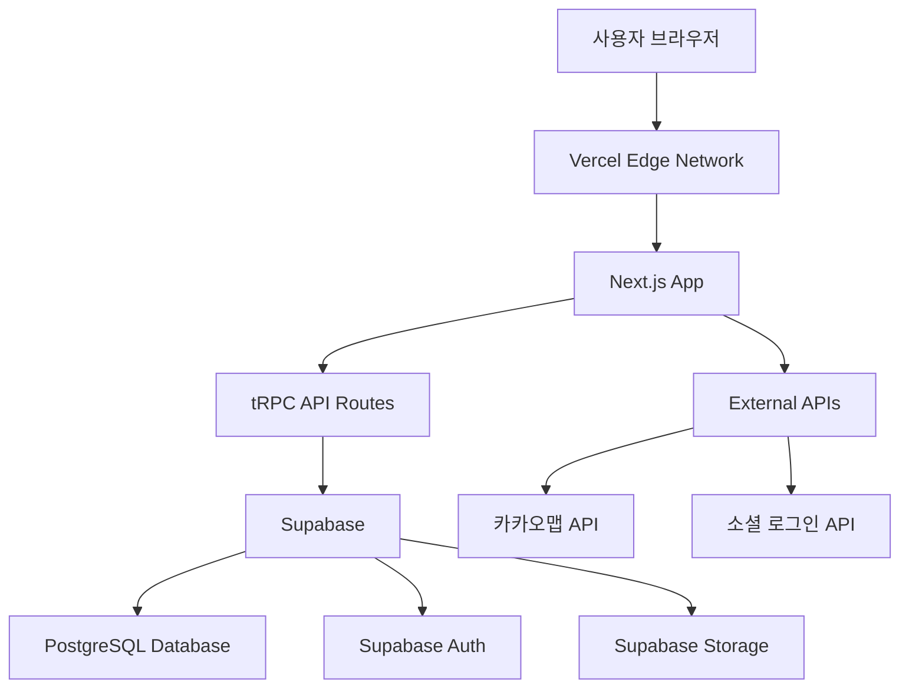

# 디자인 문서

## 개요

모바일 청첩장 서비스는 Next.js 기반의 풀스택 웹 애플리케이션입니다. tRPC를 통한 타입 안전한 API 통신, Supabase를 통한 데이터베이스 및 인증 관리, Vercel을 통한 간편한 배포를 제공합니다. 모바일 우선 설계(Mobile-First Design)를 적용하여 반응형 웹 인터페이스를 제공하며, PWA(Progressive Web App) 기능을 통해 네이티브 앱과 유사한 사용자 경험을 제공합니다.

## 아키텍처

### 전체 시스템 아키텍처



**아키텍처 구성 요소:**

- **Vercel Edge Network**: 전 세계 CDN, 자동 SSL, 서버리스 배포
- **Next.js App**: 풀스택 React 애플리케이션 (SSR, SSG, API Routes)
- **tRPC**: 타입 안전한 API 통신 (프론트엔드-백엔드 간)
- **Supabase**: BaaS (Backend as a Service) - 데이터베이스, 인증, 스토리지 통합

### 기술 스택

**풀스택 프레임워크:**

- Next.js 14+ with App Router
- TypeScript 5.0+
- React 18+ (Server Components + Client Components)
- Tailwind CSS 3.3+ (모바일 우선 반응형 디자인)

**API 및 상태 관리:**

- tRPC 10+ (타입 안전한 API)
- TanStack Query 4+ (서버 상태 관리, tRPC와 통합)
- Zod (스키마 검증)
- React Hook Form 7.0+ (폼 관리)

**데이터베이스 및 백엔드 서비스:**

- Supabase (PostgreSQL + Auth + Storage + Real-time)
- Prisma 5.0+ (ORM, Supabase와 연동)
- Supabase Auth (소셜 로그인, JWT 관리)
- Supabase Storage (이미지 파일 저장)

**배포 및 호스팅:**

- Vercel (서버리스 배포, Edge Functions)
- PWA 설정 (Service Worker, Web App Manifest)

**외부 서비스:**

- 카카오맵 API (지도 서비스)
- 카카오/구글 OAuth (Supabase Auth 연동)
- Resend (이메일 서비스, Vercel 권장)

## 컴포넌트 및 인터페이스

### Next.js 프로젝트 구조

```
src/
├── app/                          # Next.js 14 App Router
│   ├── (auth)/
│   │   ├── login/page.tsx
│   │   └── signup/page.tsx
│   ├── dashboard/
│   │   ├── page.tsx
│   │   └── [id]/page.tsx
│   ├── invitation/
│   │   ├── create/page.tsx
│   │   └── [code]/page.tsx
│   ├── api/
│   │   └── trpc/[trpc]/route.ts  # tRPC API handler
│   ├── layout.tsx               # Root layout
│   ├── page.tsx                 # Home page
│   └── globals.css
├── components/
│   ├── ui/                      # Shadcn/ui components
│   ├── common/
│   │   ├── Header.tsx
│   │   ├── Footer.tsx
│   │   └── LoadingSpinner.tsx
│   ├── auth/
│   │   ├── LoginForm.tsx
│   │   ├── SignupForm.tsx
│   │   └── SocialLogin.tsx
│   ├── invitation/
│   │   ├── TemplateSelector.tsx
│   │   ├── InvitationEditor.tsx
│   │   ├── InvitationPreview.tsx
│   │   └── ShareModal.tsx
│   ├── rsvp/
│   │   ├── RSVPForm.tsx
│   │   └── RSVPConfirmation.tsx
│   └── dashboard/
│       ├── StatsDashboard.tsx
│       ├── GuestList.tsx
│       └── ExportData.tsx
├── server/                      # tRPC server
│   ├── api/
│   │   ├── routers/
│   │   │   ├── auth.ts
│   │   │   ├── invitation.ts
│   │   │   ├── rsvp.ts
│   │   │   └── template.ts
│   │   ├── root.ts
│   │   └── trpc.ts
│   └── db/
│       ├── schema.ts            # Prisma schema
│       └── index.ts
├── lib/
│   ├── supabase.ts              # Supabase client
│   ├── utils.ts
│   └── validations.ts           # Zod schemas
└── hooks/
    ├── useAuth.ts
    ├── useInvitation.ts
    └── useRSVP.ts
```

### tRPC API 라우터 설계

**tRPC 라우터 구조:** 타입 안전한 API 통신을 위한 프로시저 기반 설계

**인증 라우터 (auth.ts):**

```typescript
export const authRouter = createTRPCRouter({
  register: publicProcedure
    .input(registerSchema)
    .mutation(async ({ input }) => {
      /* Supabase Auth 회원가입 */
    }),

  login: publicProcedure.input(loginSchema).mutation(async ({ input }) => {
    /* Supabase Auth 로그인 */
  }),

  logout: protectedProcedure.mutation(async ({ ctx }) => {
    /* Supabase Auth 로그아웃 */
  }),

  getSession: publicProcedure.query(async ({ ctx }) => {
    /* 현재 세션 정보 */
  }),

  deleteAccount: protectedProcedure.mutation(async ({ ctx }) => {
    /* 계정 삭제 */
  }),
});
```

**청첩장 라우터 (invitation.ts):**

```typescript
export const invitationRouter = createTRPCRouter({
  getAll: protectedProcedure.query(async ({ ctx }) => {
    /* 사용자 청첩장 목록 */
  }),

  getById: protectedProcedure
    .input(z.object({ id: z.string() }))
    .query(async ({ input, ctx }) => {
      /* 청첩장 조회 */
    }),

  getByCode: publicProcedure
    .input(z.object({ code: z.string() }))
    .query(async ({ input }) => {
      /* 공개 청첩장 조회 */
    }),

  create: protectedProcedure
    .input(createInvitationSchema)
    .mutation(async ({ input, ctx }) => {
      /* 청첩장 생성 */
    }),

  update: protectedProcedure
    .input(updateInvitationSchema)
    .mutation(async ({ input, ctx }) => {
      /* 청첩장 수정 */
    }),

  delete: protectedProcedure
    .input(z.object({ id: z.string() }))
    .mutation(async ({ input, ctx }) => {
      /* 청첩장 삭제 */
    }),

  uploadImage: protectedProcedure
    .input(z.object({ file: z.string() }))
    .mutation(async ({ input, ctx }) => {
      /* Supabase Storage 이미지 업로드 */
    }),
});
```

**RSVP 라우터 (rsvp.ts):**

```typescript
export const rsvpRouter = createTRPCRouter({
  submit: publicProcedure
    .input(rsvpSubmissionSchema)
    .mutation(async ({ input }) => {
      /* RSVP 제출 */
    }),

  getResponses: protectedProcedure
    .input(z.object({ invitationId: z.string() }))
    .query(async ({ input, ctx }) => {
      /* RSVP 응답 목록 */
    }),

  getStats: protectedProcedure
    .input(z.object({ invitationId: z.string() }))
    .query(async ({ input, ctx }) => {
      /* RSVP 통계 */
    }),

  exportData: protectedProcedure
    .input(z.object({ invitationId: z.string() }))
    .mutation(async ({ input, ctx }) => {
      /* 데이터 내보내기 */
    }),
});
```

**템플릿 라우터 (template.ts):**

```typescript
export const templateRouter = createTRPCRouter({
  getAll: publicProcedure.query(async () => {
    /* 템플릿 목록 */
  }),

  getByCategory: publicProcedure
    .input(
      z.object({
        category: z.enum(["classic", "modern", "romantic", "minimal"]),
      })
    )
    .query(async ({ input }) => {
      /* 카테고리별 템플릿 */
    }),
});
```

## 데이터 모델

### 데이터베이스 스키마

```sql
-- 사용자 테이블
CREATE TABLE users (
    id UUID PRIMARY KEY DEFAULT gen_random_uuid(),
    email VARCHAR(255) UNIQUE NOT NULL,
    password_hash VARCHAR(255),
    name VARCHAR(100) NOT NULL,
    provider VARCHAR(50) DEFAULT 'email',
    provider_id VARCHAR(255),
    email_verified BOOLEAN DEFAULT FALSE,
    created_at TIMESTAMP DEFAULT CURRENT_TIMESTAMP,
    updated_at TIMESTAMP DEFAULT CURRENT_TIMESTAMP
);

-- 청첩장 테이블
CREATE TABLE invitations (
    id UUID PRIMARY KEY DEFAULT gen_random_uuid(),
    user_id UUID REFERENCES users(id) ON DELETE CASCADE,
    title VARCHAR(200) NOT NULL,
    groom_name VARCHAR(100) NOT NULL,
    bride_name VARCHAR(100) NOT NULL,
    wedding_date DATE NOT NULL,
    wedding_time TIME NOT NULL,
    venue_name VARCHAR(200) NOT NULL,
    venue_address TEXT NOT NULL,
    venue_lat DECIMAL(10, 8),
    venue_lng DECIMAL(11, 8),
    template_id VARCHAR(50) NOT NULL,
    custom_message TEXT,
    dress_code VARCHAR(100),
    parking_info TEXT,
    meal_info TEXT,
    special_notes TEXT,
    rsvp_enabled BOOLEAN DEFAULT TRUE,
    rsvp_deadline DATE,
    invitation_code VARCHAR(8) UNIQUE NOT NULL,
    background_image_url VARCHAR(500),
    created_at TIMESTAMP DEFAULT CURRENT_TIMESTAMP,
    updated_at TIMESTAMP DEFAULT CURRENT_TIMESTAMP
);

-- RSVP 응답 테이블
CREATE TABLE rsvp_responses (
    id UUID PRIMARY KEY DEFAULT gen_random_uuid(),
    invitation_id UUID REFERENCES invitations(id) ON DELETE CASCADE,
    guest_name VARCHAR(100) NOT NULL,
    guest_phone VARCHAR(20),
    attendance_status VARCHAR(20) NOT NULL CHECK (attendance_status IN ('attending', 'not_attending')),
    adult_count INTEGER DEFAULT 1,
    child_count INTEGER DEFAULT 0,
    message TEXT,
    submitted_at TIMESTAMP DEFAULT CURRENT_TIMESTAMP
);

-- 청첩장 조회 로그 테이블
CREATE TABLE invitation_views (
    id UUID PRIMARY KEY DEFAULT gen_random_uuid(),
    invitation_id UUID REFERENCES invitations(id) ON DELETE CASCADE,
    ip_address INET,
    user_agent TEXT,
    viewed_at TIMESTAMP DEFAULT CURRENT_TIMESTAMP,
    view_duration INTEGER -- 초 단위
);

-- 템플릿 테이블
CREATE TABLE templates (
    id VARCHAR(50) PRIMARY KEY,
    name VARCHAR(100) NOT NULL,
    category VARCHAR(50) NOT NULL,
    preview_image_url VARCHAR(500) NOT NULL,
    css_styles JSONB NOT NULL, -- 색상, 폰트, 레이아웃 스타일 정보
    html_structure TEXT NOT NULL, -- {{groomName}}, {{brideName}} 등 플레이스홀더 포함 HTML
    created_at TIMESTAMP DEFAULT CURRENT_TIMESTAMP
);
```

### TypeScript 인터페이스

```typescript
interface User {
  id: string;
  email: string;
  name: string;
  provider: "email" | "kakao" | "google";
  emailVerified: boolean;
  createdAt: Date;
}

interface Invitation {
  id: string;
  userId: string;
  title: string;
  groomName: string;
  brideName: string;
  weddingDate: Date;
  weddingTime: string;
  venueName: string;
  venueAddress: string;
  venueLat?: number;
  venueLng?: number;
  templateId: string;
  customMessage?: string;
  dressCode?: string;
  parkingInfo?: string;
  mealInfo?: string;
  specialNotes?: string;
  rsvpEnabled: boolean;
  rsvpDeadline?: Date;
  invitationCode: string;
  backgroundImageUrl?: string;
  createdAt: Date;
  updatedAt: Date;
}

interface RSVPResponse {
  id: string;
  invitationId: string;
  guestName: string;
  guestPhone?: string;
  attendanceStatus: "attending" | "not_attending";
  adultCount: number;
  childCount: number;
  message?: string;
  submittedAt: Date;
}

interface Template {
  id: string;
  name: string;
  category: "classic" | "modern" | "romantic" | "minimal";
  previewImageUrl: string;
  cssStyles: Record<string, any>;
  htmlStructure: string;
}
```

## 에러 핸들링

### tRPC 에러 처리

```typescript
// tRPC 에러 처리 (server/api/trpc.ts)
import { TRPCError } from "@trpc/server";

// 커스텀 에러 생성
const createError = (code: string, message: string) => {
  throw new TRPCError({
    code: code as any,
    message,
  });
};

// tRPC 프로시저에서 에러 처리 예시
export const protectedProcedure = publicProcedure.use(async ({ ctx, next }) => {
  if (!ctx.session?.user) {
    throw new TRPCError({
      code: "UNAUTHORIZED",
      message: "로그인이 필요합니다.",
    });
  }
  return next({
    ctx: {
      ...ctx,
      session: ctx.session,
    },
  });
});
```

### 프론트엔드 에러 처리

```typescript
// React Error Boundary (components/common/ErrorBoundary.tsx)
"use client";

import React from "react";

interface ErrorBoundaryState {
  hasError: boolean;
  error?: Error;
}

export class ErrorBoundary extends React.Component<
  React.PropsWithChildren<{}>,
  ErrorBoundaryState
> {
  constructor(props: React.PropsWithChildren<{}>) {
    super(props);
    this.state = { hasError: false };
  }

  static getDerivedStateFromError(error: Error): ErrorBoundaryState {
    return { hasError: true, error };
  }

  render() {
    if (this.state.hasError) {
      return (
        <div className="min-h-screen flex items-center justify-center">
          <div className="text-center">
            <h2 className="text-xl font-semibold mb-2">문제가 발생했습니다</h2>
            <p className="text-gray-600 mb-4">잠시 후 다시 시도해 주세요.</p>
            <button
              onClick={() => window.location.reload()}
              className="px-4 py-2 bg-blue-500 text-white rounded hover:bg-blue-600"
            >
              새로고침
            </button>
          </div>
        </div>
      );
    }

    return this.props.children;
  }
}

// tRPC 에러 처리 훅 (hooks/useErrorHandler.ts)
import { TRPCClientError } from "@trpc/client";
import { useRouter } from "next/navigation";
import { toast } from "sonner";

export const useErrorHandler = () => {
  const router = useRouter();

  const handleError = (error: unknown) => {
    if (error instanceof TRPCClientError) {
      switch (error.data?.code) {
        case "UNAUTHORIZED":
          toast.error("로그인이 필요합니다.");
          router.push("/login");
          break;
        case "FORBIDDEN":
          toast.error("접근 권한이 없습니다.");
          break;
        case "BAD_REQUEST":
          toast.error("입력하신 정보를 다시 확인해 주세요.");
          break;
        case "INTERNAL_SERVER_ERROR":
          toast.error("서버 오류가 발생했습니다. 잠시 후 다시 시도해 주세요.");
          break;
        default:
          toast.error("알 수 없는 오류가 발생했습니다.");
      }
    } else {
      toast.error("네트워크 오류가 발생했습니다.");
    }
  };

  return { handleError };
};
```

## 테스트 전략

### 단위 테스트 (목표 커버리지: 80% 이상)

- Jest + React Testing Library (프론트엔드)
- Jest + Supertest (백엔드 API)
- 각 컴포넌트 및 유틸리티 함수 테스트
- 비즈니스 로직 함수 테스트

### 통합 테스트 (목표 커버리지: 주요 API 엔드포인트 100%)

- API 엔드포인트 테스트
- 데이터베이스 연동 테스트
- 외부 서비스 연동 테스트 (Mock 사용)
- 인증/인가 플로우 테스트

### E2E 테스트 (주요 사용자 플로우 커버)

- Playwright를 사용한 주요 사용자 플로우 테스트
- 청첩장 생성 → 공유 → RSVP 제출 → 관리 전체 플로우
- 모바일/데스크톱 반응형 테스트
- 다양한 브라우저 호환성 테스트 (Chrome, Safari, Firefox)

### 성능 테스트

- Lighthouse를 사용한 웹 성능 측정
- 페이지 로드 시간 3초 이내 목표
- 이미지 최적화 및 압축 테스트
- 동시 접속자 1000명 부하 테스트

## 보안 고려사항

### 인증 및 인가

- JWT 토큰 기반 인증 (Access Token: 15분, Refresh Token: 7일)
- Refresh Token을 Redis에 저장하여 세션 고정 공격 방지
- 비밀번호 해싱 (bcrypt, salt rounds: 12)
- Rate Limiting (API 호출 제한: 100req/min per IP)
- JWT 블랙리스트를 Redis에 저장하여 로그아웃된 토큰 무효화

### 데이터 보호

- HTTPS 강제 적용 (HTTP → HTTPS 리다이렉트)
- SQL Injection 방지 (Prisma ORM 사용)
- XSS 방지 (입력 데이터 검증 및 이스케이프, CSP 헤더 적용)
- CSRF 방지 (Double Submit Cookie Pattern 사용)
- 개인정보 암호화 저장 (AES-256-GCM)

### 파일 업로드 보안

- 파일 타입 검증 (MIME 타입 + 파일 시그니처 검증)
- 파일 크기 제한 (최대 5MB)
- 파일명 무작위화 (UUID + 타임스탬프)
- 이미지 메타데이터 제거 (EXIF 데이터 삭제)
- 바이러스 스캔 (ClamAV 연동, 선택사항)

## 성능 최적화

### 프론트엔드 최적화

- 코드 스플리팅 (React.lazy)
- 이미지 지연 로딩 (Lazy Loading)
- 서비스 워커를 통한 캐싱
- 번들 크기 최적화

### 백엔드 최적화

- **Redis 캐싱 전략:**
  - 템플릿 정보 캐싱 (Read-Through 패턴, TTL: 1시간)
  - 자주 조회되는 청첩장 데이터 캐싱 (Write-Through 패턴, TTL: 30분)
  - RSVP 통계 데이터 캐싱 (Lazy Loading 패턴, TTL: 5분)
- 데이터베이스 쿼리 최적화 (인덱스 활용, N+1 쿼리 방지)
- 이미지 압축 및 WebP 변환 (Sharp 라이브러리 활용)
- CDN을 통한 정적 파일 제공 (CloudFlare)

### 데이터베이스 최적화

- 적절한 인덱스 설정
- 쿼리 성능 모니터링
- 커넥션 풀 관리

이 설계를 통해 요구사항에서 명시한 모든 기능을 효율적이고 안전하게 구현할 수 있으며, 모바일 환경에서 최적의 사용자 경험을 제공할 수 있습니다.
